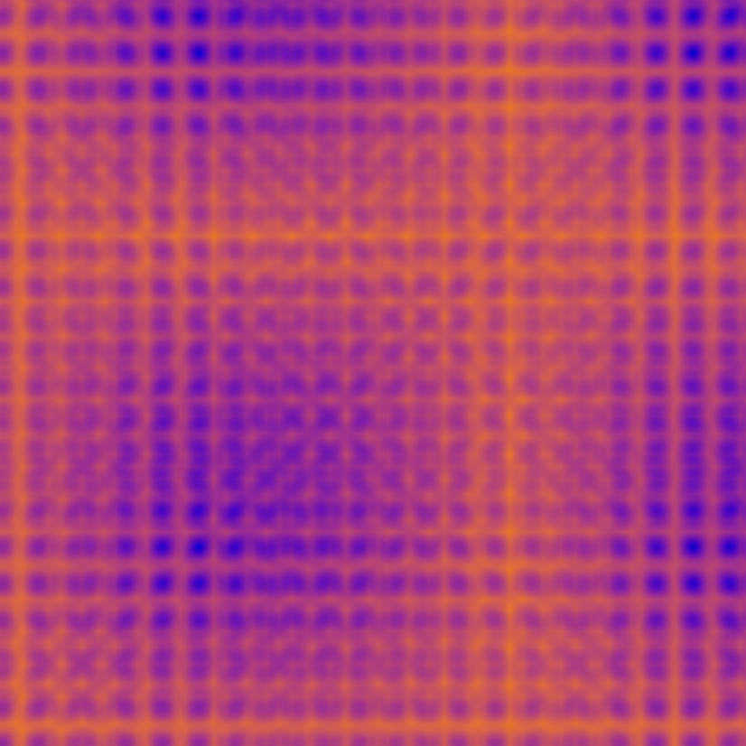
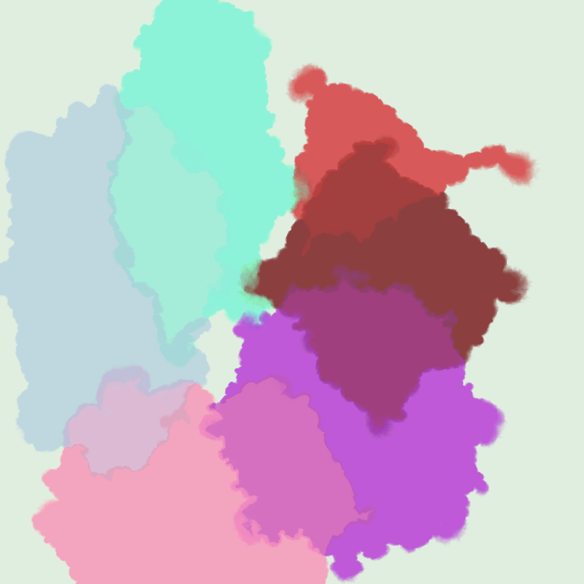

```{r setup, include=FALSE}
knitr::opts_chunk$set(echo = FALSE)
```

In the course Math 230 Data Visualization and Computing, I have made many visualizations throughout projects, class, homework assignments and labs. Here are a few of the ones I have made throughout the semester.

# Generative Art


```{r}
library(ggplot2)
```



**Bucknell University Circlemap**


**Nebula**



**Watercolors**

# GGPlot Extensions Project (GGSide)

```{r, message = FALSE, warning = FALSE}
library(Lock5Data)
library(ggside)
data(SleepStudy)
attach(SleepStudy)
```

For my GGExtention project, my group was assigned to the extention GGSide. GGSide is a way to incorporate many different graphs in one to give a wide range of data in one place, which is shown below. 

The dataset we used is called SleepStudy, and it measures the quality of sleep along with other variables that may be affecting the sleep schedule itself. This dataset allowed us to look for correlations between stress and alcohol use with sleeping schedules and the quality of the sleep. Using GGSide, we were able to look for these correlations.

In our project, we decided to use the main plot to create a scatterplot, because it is a generic plot that is easy to understand and it is effective for showing raw data. We then used different types of graphs on the sides of the graphs, including boxplots, density plots and barcharts. There are many possibilities for this, because of the variety of plots that can be incorporated and the variations within those plots. 

**Poor Sleep Quality vs Stress Score and Alcohol Use With Density Plots**

```{r message=FALSE, warning=FALSE}
ggplot(SleepStudy, aes(x = PoorSleepQuality, y = StressScore, color = AlcoholUse)) +
  geom_point(size = 2) +
  geom_xsidedensity(aes(y = after_stat(density))) +
  geom_ysidedensity(aes(x = after_stat(density))) +
  xlab("Poor Sleep Quality") +
  ylab("Stress Score") +
  labs(color = "Alcohol Use") +
  labs(caption = "Figure 1") +
  ggtitle("Poor Sleep Quality vs Stress Score and Alcohol Use - Density Plots") +
  theme(axis.text.x = element_text(angle = 90), ggside.panel.scale = .3) 
```


**Poor Sleep Quality vs Stress Score and Alcohol Use With Boxplot and Barchart**

```{r message=FALSE, warning=FALSE}
ggplot(SleepStudy, aes(x = PoorSleepQuality, y = StressScore, color = AlcoholUse)) +
  geom_point(size = 2) +
  geom_xsideboxplot(aes(y = AlcoholUse), orientation = "y") +
  scale_xsidey_discrete() +
  geom_ysidebar(position = "fill") +
  xlab("Poor Sleep Quality") +
  ylab("Stress Score") +
  ggtitle("Poor Sleep Quality vs Stress Score and Alcohol Use - Box & Bar") +
  labs(color = "Alcohol Use") +
  labs(caption = "Figure 2") +
  theme(axis.text.x = element_text(angle = -90), ggside.panel.scale = .3)
```


# Static Version Of Confidence Level Graph

For the confidence level project, my group decided to make the static version of our project at a confidence level of 95%, and the sample size is 1000. As seen in the legend, the samples that included the true mean (in this case the value of 10) are colored blue whereas the samples that did not include the true mean value were colored red. 

**Static 95% Confidence Intervals where n = 1000**

```{r}
set.seed(23)
samplemeans1000 = NULL
samplesd1000 = NULL

n3 = 1000
truemean = 10
truesd = 3

for (i in 1:50) {
  samplemeans1000[i] = mean(rnorm(n3, truemean, truesd))
  samplesd1000[i] = sd(rnorm(n3, truemean, truesd))
}

CI <- function(n, samplemean, sd, confidencelevel) {
  lowerbound = samplemean - qnorm(1-(1-confidencelevel)/2)*(sd/sqrt(n))
  upperbound = samplemean + qnorm(1-(1-confidencelevel)/2)*(sd/sqrt(n))
  trial = c(1:50)
  confidence.interval = upperbound - lowerbound
  return(data.frame(cbind(trial, lowerbound, upperbound, confidence.interval)))
}

c = CI(n3, samplemeans1000, samplesd1000, .95)
```

```{r message=FALSE, warning=FALSE}
ggplot(c, aes(x = samplemeans1000, y = trial, group = confidence.interval)) +
geom_errorbar(aes(xmin= lowerbound, xmax= upperbound, color = ifelse(upperbound < 10 | lowerbound > 10, "Does Not Include", "Includes")), width=.2, position=position_dodge(.9)) +
  geom_dotplot(binaxis='y', stackdir='center') +
  ylab("Trial Number") +
  xlab("Sample Mean and resulting CI with Pop Mean Line") +
  ggtitle("95% Confidence intervals where n=1000") +
  geom_vline(xintercept = 10, color = "red") +
  theme(axis.text.x = element_text(angle = 45))+
  theme(legend.position = "bottom") +
  labs(color = "True Mean Value") +
  theme(plot.caption = element_text(hjust = 0.5))+
  theme(plot.title = element_text(size=8))+
  theme(axis.title.x  = element_text(size=7))+
  theme(axis.title.y  = element_text(size=7))+
  theme(plot.caption = element_text(size=5))
```

# Interactive Shiny Project

The link below is the link to the interactive version of the project, with adjustable confidence levels and sample sizes. While adjusting, you may notice that smaller sample sizes and smaller percentages of confidence have longer error bars indicating larger room for error.

https://rconnect.bucknell.edu/content/2c3f0336-668a-46c0-ab93-036e915446c4


# Other Visualizations Throughout Class

```{r, eval = FALSE}
library(Lock5Data)
data(Cars2020)
str(Cars2020)
```

```{r, eval = FALSE}
library(MASS)
data(survey)
str(survey)
```

For my first visualization from the course, I decided to include a barchart that is from the cars 2020 dataset. This dataset measures many variables when it comes to cars, including but not limited to their type, drive, top speed, model, and more. We can use this dataset to further understand different aspects of cars and where there are correlations.

**Barchart of Drive vs Type**

In this chart, the variable drive (AWD, FWD, or RWD) is on the x axis and the density of each type of car is represented in the bars as different colors. The legend helps the viewer understand which color corresponds to which type. I chose to include this graph because it is relatively easy to understand, but it is not entirely too basic and boring to the eye. This visualization is interesting because it shows that all of the RWD in the dataset are sporty cars. 


```{r}
ggplot(Cars2020, aes(x = Drive, fill = Type)) +
  geom_bar(position = "fill") +
  ylab(" ") +
ggtitle("Barchart of Drive vs Type")
```

```{r}
data(StudentSurvey)
StudentSurvey = StudentSurvey[complete.cases(StudentSurvey), ]
StudentSurvey$Year = factor(StudentSurvey$Year, 
                          levels = c("FirstYear", "Sophomore", "Junior", "Senior"),
                          ordered = TRUE)
attach(StudentSurvey)
```

For the final two visualizations, the dataset StudentSurvey is being used. The dataset StudentSurvey measures miscellaneous variables to look for correlations, including GPA, prefered award, smoking status, exercise, TV watched, and more. These variables are measured through

**Award vs GPA**

The second visualization I decided to include from class was a violin plot of type of award preferred and the GPA of those individuals. I found this specific visualization interesting because it also includes a dot plot inside the violin plots, which adds value to the observer to understand where the majority of the data falls. 

```{r}
ggplot(StudentSurvey, aes(x = Award, y = GPA, fill = Award)) +
  geom_violin(scale = "width", alpha = .5) +
  guides(fill = "none") +
  geom_dotplot(binaxis = "y", binwidth = .1, stackdir = "center", dotsize = .25) +
  ggtitle("Award vs GPA")
```

**Exercise vs TV Watched, Award Preference and Smoking Status**

The final visualization from the course I found valuable to include was this scatterplot that includes four variables. These variables include exersize, TV, smoking status and award preference. This is a valuable visualization because it includes four different variables and yet is not necessarily difficult to understand. This has both the x axis for the exercise variable and y axis for the TV variable, different colors to differentiate smoking status and finally different shapes to differentiate the award preference.

```{r}
ggplot(StudentSurvey, aes(x = Exercise, y = TV, color = Smoke, shape = Award)) +
  geom_point(alpha = 2/3, size = 2) + 
  scale_color_brewer(palette = "Set2") + 
  labs(color = "Smoking Status", shape = "Award Preference") +
ggtitle("Exercise vs TV Watched, Award Preference and Smoking Status")
```

